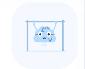
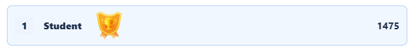
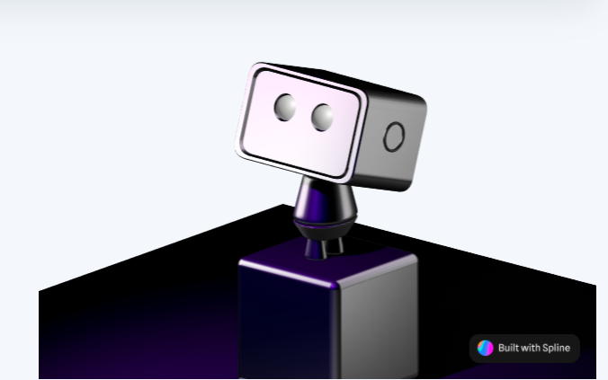
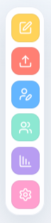

# LearnAi

Trivia web app built with React, ASP.NET Core, Firebase, and OpenAI.

## Requirements

- .NET SDK 9
- Node.js and npm
- Firebase project
- OpenAI API key

## Setup

Create the client environment file:

```powershell
cd TrivAi.Client
Copy-Item .env.example .env
```

Fill `.env` with the Firebase Web App configuration:

```text
VITE_FIREBASE_API_KEY=
VITE_FIREBASE_AUTH_DOMAIN=
VITE_FIREBASE_PROJECT_ID=
VITE_FIREBASE_MESSAGING_SENDER_ID=
VITE_FIREBASE_APP_ID=
```

Enable Email/Password Authentication and Cloud Firestore in Firebase.

Publish the rules from `firestore.rules` in Firebase Console.

## Graphics and Visual Systems

The app includes a few graphics-focused pieces that are useful to mention in a computer graphics presentation:

- `SVG icons` for navigation, settings, and status indicators.
  These are vector-based, so they stay sharp at any size and are easy to recolor through CSS.
- `Lottie animations` for loading, confetti, winner feedback, and dashboard visuals.
  They are JSON animations rendered in the browser, which makes them lighter and easier to reuse than video files.
- `Static PNG previews` for the same animation set.
  These are useful in documentation and presentation material when you want a quick visual reference without playing the animation.
- `Avatar composition` built from layered parts such as face, hair, accessories, clothing, and background.
  The avatar is assembled from separate visual layers, which makes it customizable without needing a new image for every variation.
- `Theme switching` that updates the same interface between light and dark visual modes.
  The app keeps one layout and swaps the visual palette through state-driven styling, which is a clean way to support multiple presentation modes.
- `Daily reward calendar` that uses visual states like claimed, today, and locked.
  This turns progress into a visible interface element instead of a hidden value.
- `XP and progress UI` that turns score and streaks into visible game feedback.
  The interface uses bars, counters, and highlighted states to make advancement feel immediate and understandable.

### Animation previews

| Preview | Use |
| --- | --- |
|  | Dashboard brain animation |
|  | Winner / leaderboard highlight |
|  | Menu robot visual |
|  | Icon set preview |

## Run

Start the API:

```powershell
$env:OPENAI_API_KEY="your-key"
dotnet run --project TrivAi.Api --urls http://localhost:5080
```

Start the client in another terminal:

```powershell
cd TrivAi.Client
npm install
npm run dev -- --port 5173
```

Open `http://127.0.0.1:5173`.
****
